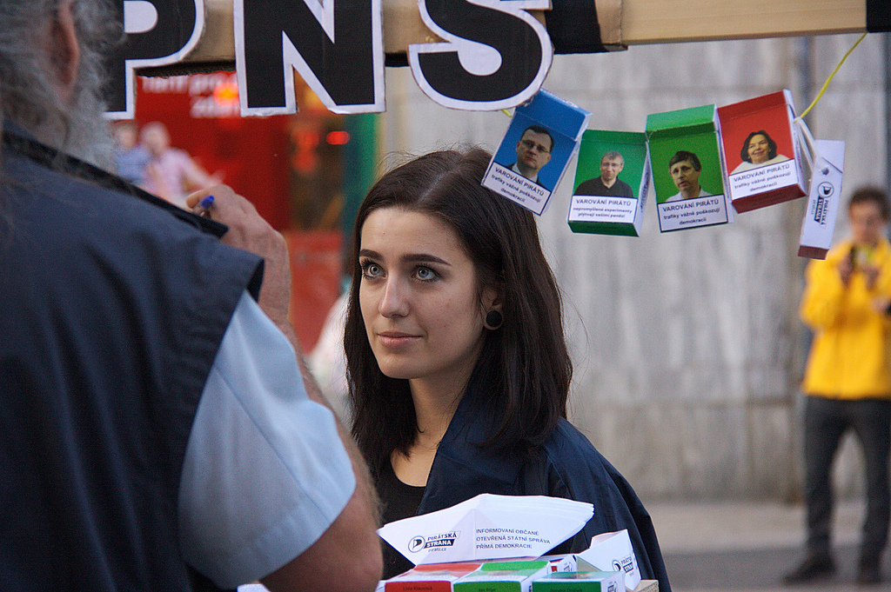
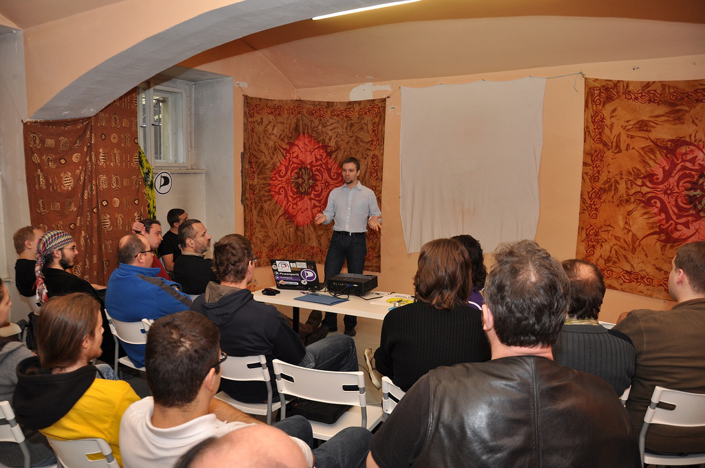
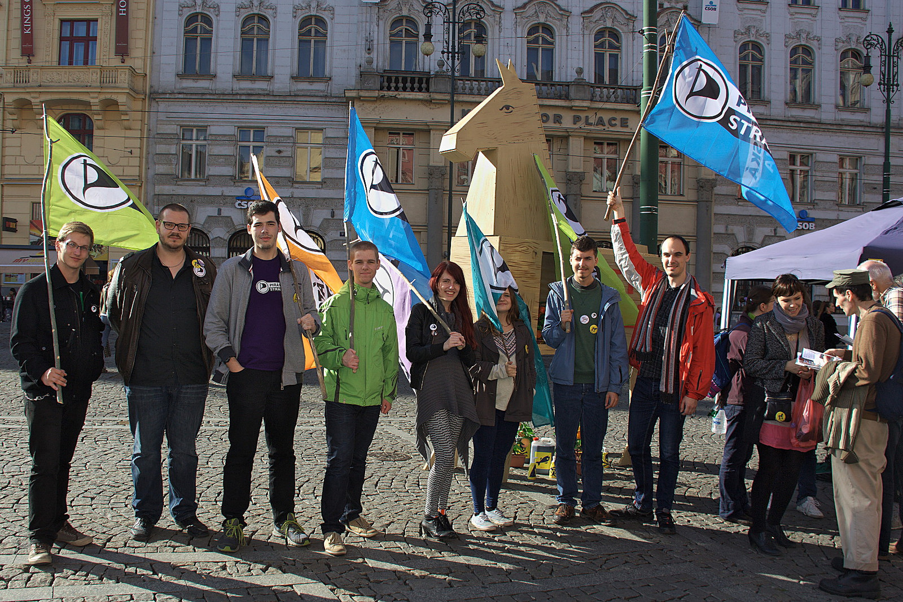

Příručka Piráta
=================

**Ahoj, my jsme Piráti a chceme vládnout Praze. Přidej se jako dobrovolník!**

**Pirátství je sexy.** Makat jako Pirátský dobrovolník má výhody, na které u jiné práce nenarazíš:

* Poznáš politiku zevnitř, kde je horká
* Pomůžeš sobě i lidem v okolí k lepšímu životu
* Naučíš se používat nové technologie
* Seznámíš se super Piráty, včetně zastupitelů, starosty, senátora a europoslankyně
* Získáš cenné a jedinečně zkušenosti do životopisu
* a hlavně: **zapojíš se do aktivit, které mají smysl!**

I když není práce dobrovolníka placená, neznamená to, že není třeba k ní přistupovat zodpovědně. Naopak, zodpovědnost je nutnou podmínkou! Pirátským dobrovolníkem se můžeš stát bez ohledu na věk.

Internet je naše moře
=====================

Každá skupina lidí potřebuje místo, kde komunikuje. Pro Piráty je tímto místem Internet. Dokážeme se zde zorganizovat, volit představitele a rozhodovat.

* **Fórum** krajského sdružení Praha je místem pro společnou tvorbu, diskusi a domlouvání se s ostatními Piráty. Najdeš ho na adrese <http://forum.pirati.cz>.
* **Redmine** je systém na organizaci dobrovolníků, kde najdete volné úkoly, jak pomoci našemu společnému úsilí. Najdeš ho na adrese <http://redmine.pirati.cz/projects/praha>.

Samozřejmě se scházíme i mimo klávesnici. Každý příznivec Pirátů by měl trefit do Pirátského centra (Řehořova 19, Žižkov, 7 minut chůze z Hlavního nádraží), kde se konají veřejné akce

* **Na pivo s pražskými zastupiteli** – od 18:00 – každé první úterý v měsíci se schází celý zastupitelský klub, aby v pohodě u piva diskutoval o věcech, se kterými přijdete, anebo které jsou zrovna aktuální. Ideální prostředí pro seznámení. 
* **Zastupitelský úterek** – 18:00-19:00 – všechny úterky, kdy není jiná akce, se koná zastupitelské úterý, na kterém některých z Pirátských zastupitelů nebo hostů mluví o zajímavém tématu (pozvánky jsou na facebooku pražských Pirátů a v kalendáři na webu pražských Pirátů).
* **Porada pražských zastupitelů** – od 18:00 – vždy úterý před celopražským zastupitelstvem (termíny jsou na webu Prahy) diskutujeme horké body na zastupitelstvo a aktivity v městských částech.
* **Zasedání krajského fóra** – od 18:30 – velká schůze všech Pirátů v krajském sdružení Praha, kde se řeší připravované akce, horké novinky, důležitá politická rozhodnutí apod., vždy poslední čtvrtek v měsíci (ledaže se koná zastupitelstvo, pak se přesouvá o týden dříve). Na schůzi krajského fóra se také představují nováčci, přijímáme je a ukazujeme jim, jak se připojit online. Každý nováček má svého průvodce, kterým je zkušený člen.

Pirátské aktivity
========================

Právě se díváte na nelegální fotku. Podle belgických zákonů je zakázáno volně šířit fotografie se stavbou *Atomium* bez souhlasu vlastníka copyrightu! Díky dobrovolníkům v celé Evropě jsme v červenci roku 2015 zabránili, aby Evropský parlament rozšířil zákaz focení staveb i do České republiky!

Díky dobrovolníkům Pirátská strana mění svět v lepší místo k životu. Nabízíme následující aktivity, do kterých se můžeš zapojit:

Akce v ulicích
---------------

Piráti se prezentují na různých veřejných akcích, kde potřebujeme velký počet dobrovolníků:
 
* **Infostánky**. Seznamujeme veřejnost s činností Pirátské strany, sbíráme podpisy pod petice, rozdáváme informační letáčky a prodáváme naše propagační předměty.
* **Happeningy a demonstrace**. Abychom upozornili na důležitou věc, jako je např. příprava špatného zákona, pořádáme happeningy a demonstrace v ulicích.
* **Rozdávání Pirátských novin**. Aspoň jednou za rok se občané města dozví aktuální informace o činnosti Pirátů v zastupitelstvu.

Také ty můžeš zorganizovat nějakou užitečnou aktivitu, např. šíření informací o tom, jak mužou restaurace ušetřit díky svobodné hudbě, úklid místního parku nebo okolí řeky, hudební nebo filmový festival se svobodnou tvorbou, zorganizovat pirátskou konferenci Piratecon na některé zajímavé téma. Takové akce velmi vítáme a podporujeme!

Pro účast na těchto akcích se stačí přihlásit na internetových stránkách s e-mailem a telefonem, kam budeme posílat pozvánky, v případě potřeby obvolávat. Kontakty a poptávané akce lze také najít na facebookové skupině <https://www.facebook.com/groups/125479366717> 

Pomoc zastupitelům
------------------

V kanceláři zastupitelů přímo v Nové radnici je Pirátský dobrovolník jedinečnou posilou, protože svou prací citelně odlehčují zastupitelům, kteří se pak mohou věnovat své práci. Dobrovolníci jsou v tomto ohledu velkou úlevou, protože zvládnou zařídit spoustu věcí. Hledáme i odborníky pro jednotlivé oblasti.

Často potřebujeme pomoci s administrativou, tříděním dat, s jejich vkládáním do počítače, vyhledáváním informací, vedením různých databází, ale i opravou vybavení, úklidem nebo jinými manuálními pracemi. Aktuální seznam volných míst a úkolů pro dobrovolníky naleznete v projektovém systému redmine <https://redmine.pirati.cz/projects/praha/issues?query_id=24>. 

Aktivity v kanceláři lze také provádět formou stáže na aspoň cca 8 h měsíčně.

Nejjednodušší je nám do kanceláře napsat e-mail na adresu <jan.louzek@pirati.cz>, zavolat (na číslo 236 002 333) anebo se stavit (aspoň 1 člověk by tam měl být mezi 10 a 17 hodinami každý všední den). Adresa klubu zastupitelů je Mariánské nám. 2, Praha 1, místnost č. 40 v přízemí.

Pirátské přednášky
------------------

Jde o interaktivní přednášky pro pro žáky a studenty základních a středních škol, seniory v domovech důchodců a jiná publika, která zajímá aktuální politika.

Naši zastupitelé anebo dobrovolníci chodí do škol, aby si povídali o tom, co bude s Opencard, jak se hospodaří na magistrátu, jak funguje zastupitelská demokracie, co dělají Piráti na radnici a také o tom, proč a jak musíme společně problémy řešit.

Potřebujeme dobrovolníky, kteří vytipují školu nebo jiné zařízení v místě svého bydliště, domluví s ředitelem téma vystoupení a vyřeší organizační aspekty věci. 

Jak přežít Pirátskou stranu
===========================

**Návod pro nováčky a dobrovolníky, kteří si chtějí Pirátskou stranu užít**

Pirátskou stranu jsme založili, abychom získali politický vliv a následně otevřeli hospodaření státu, ochránili soukromí občanů a přizpůsobili copyright digitálnímu věku. Za 40 let bude hotovo a strana se rozpustí. Občas to ale vypadá, že se toho nedočkáme a raději se navzájem požereme. Proto jsem sepsal tenhle návod, jak zůstat v pohodě a Pirátskou stranu nejen přežít, ale hlavně si ji užít!

Děláme politiku
---------------

Naším cílem je prosadit Pirátský program. Lidé nás podporují, chodí na naše akce a pomáhají nám jako dobrovolníci, protože jim naše cíle dávají smysl. Politika je pro ně příležitost, jak zlepšit život. Pro nás je politika také sdílení názorů, aktivní občanství, osobní výzva i zábava! Každý má svůj osobitý způsob, jak společného cíle dosahuje ve svém okolí: jednání s politiky, projekty, kampaně, happeningy, přímé akce a další aktivismus. Aktivismus zaměřujeme navenek, nechceme vyvolávat rozkoly kampaněmi směrem dovnitř či se příliš soustředit na vlastní organizaci.

Předpokládáme dobrou víru
------------------------

Všichni do jednoho chceme pro Pirátskou stranu jen to nejlepší. K nováčkům a jiným lidem je dobré přistupovat vstřícně a pomoct jim se zorientovat se. Nikdo se na politice nepodílí pro svůj zisk, ale ze svého přesvědčení. Úplně stačí, když spolu jednáme přímo. Z toho však ještě nevyplývá, že je v pohodě chovat se jako buran – to tu rozhodně netolerujeme. Vzájemná důvěra a respekt jsou základem dobrých vztahů v Pirátském hnutí a otevřenost je utvrzuje. 

Spolupracuj nebo udělej si sám
-------------------------------
K Pirátům se noví lidé přidávají, aby mohli spolupracovat s podobně smýšlejícími lidmi. Když se ti něco nelíbí, přispěj něčím, co se ti líbí. Nečekej, že donutíš někoho jiného k realizaci svých nápadů. Naopak je zkus sám realizovat. Jedna realizovaná aktivita je někdy cennější než tucet nápadů. Následuj instinkt a dej dohromady šikovné lidi, kteří ti s tím pomůžou. Pokud to má smysl, ostatní se přidají.

Otevřenost 
------------
Dej ostatním lidem šanci se zapojit do toho, co děláš. Sami se připojí k tomu, co je baví a zajímá. Neboj se požádat o pomoc. Pokud máš o něčem pochybnosti, zeptej se dalšího Piráta na jeho nezávislý názor. Lidé v naší komunitě mají fakt různorodé osobnosti, a právě to je cenné. Díky rozmanitosti a otevřenosti snáze obstojíme v konfrontaci s ostatními politickými proudy a zájmovými skupinami.

Chyby jsou dovoleny, úspěchy oslavovány
-----------------------------------------
Dobrodružství, které není nebezpečné, není dobrodružství. Čím jsem aktivnější, tím více chyb se ode mě očekává! Nechceme žádnou kulturu kibiců. Často stačí omluva, pomoc s nápravou a jedeme dál. Každá chyba nás posouvá dál. Skvělou náladu nám dodá, když můžeme oslavit úspěchy, drobná i velká vítězství v politice a aktivismu!

Funkce je zodpovědnost a mandát
-------------------------------
Zvolení funkcionáři vedou stranu. Také oni jsou z velké části dobrovolníci a bez nich bychom nemohli fungovat. Proto se sluší je respektovat, i když jsi je zrovna nevolil, nebo máš s jejich názory problém. Nadávání patří do hospody, nikoliv do politiky. Naproti tomu dobrý funkcionář vede a stmeluje tým, ocení přínos ostatních a dává prostor nejlepšímu řešení. Funkce je mandát k rozhodnutí, nikoliv argument pro špatné rozhodnutí.

Zákon dvou nohou
----------------
Pokud v nějaké konkrétní aktivitě nevidíš smysl, prostě použij svoje dvě nohy a jdi dělat něco jiného, žádné drama. Kdo dělá, co ho baví, je šťastný. Zůstal jsem ve skupině sám? No vidíš, tak přece jenom existuje aspoň jeden člověk, kterého daná činnost baví! Před odchodem ale zkus zaznamenat a nasdílet, co je třeba, aby pak mohl pokračovat zase někdo jiný.

Nekrmte trolly
----------------
Trolling je záměrné provokování v diskusi. Pokud někdo začne trollit, určitě nepomůže, když k němu přidáš nebo s ním budeš věcně diskutovat. Nejjednodušší je otravné trolly ignorovat, případně přenechat moderátorům. Někdy může být trolling i vtipný, ale neměl by přesahovat míru, kdy už ostatní obtěžuje.

Konstruktivní řešení sporů
--------------------------
Ačkoliv základem dobrých vztahů je konsensus, každá spolupráce občas provází spory. Spor nás může zničit, ale i dovést dál. Nejlepší je, když si lidé mezi sebou konstruktivně vyřeší spory sami. Pokud se nepodaří vyřešit spor dohodou, rozhodnou o něm k tomu pověřené orgány s konečnou platností. Vytváření samoúčelných spory a slovíčkaření je stejně otravné jako trolling.

Neboj se dát si oraz
---------------------
Každý z nás má rodinu, práci nebo koníčky. Nikdo není stroj. Pokud se cítíš, že si potřebuješ dát pauzu, neboj se přenechat místo někomu jinému. Střídačka není žádné selhání. Vyklizení pozice vytváří příležitost další aktivitě a střídání aktivních lidí brání rozvoji papalášských manýrů.

*Sepsáno podle osvědčených doporučení z různých komunit, odkud se rekrutují Piráti.*

Na koho se mám obrátit?
========================

Pirátská strana stojí na třech pilířích, které jsou zhruba stejně důležité: 

1. **Hejno** jsme my všichni – aktivisté a Pirátští dobrovolníci. Každý z nás svou aktivitou pomáhá společným cílům strany. Spontánní práce jednotlivců, kteří se sami navzájem organizují, je hlavním tahounem naší politiky. Každý Pirát se může obrátit na ostatní aktivisty na internetovém fóru anebo na chatu s dotazem, nápadem nebo vlastní akcí. Vedle toho se také pravidelně scházíme na krajských schůzích a na zasedání celostátního fóra (termíny akcí jsou na webu).

2. **Volení představitelé** vedou stranu a udržují její morálku, rozdělují vzácné zdroje, dělají rozhodnutí v zájmu efektivního formování veřejného mínění a jiné činnosti. Volení představitelé mají rozpočty, ze kterých vám můžou uhradit užitečné výdaje na aktivity (je dobré se domluvit předem). Oficiální žádost volenému představiteli lze zaslat přes internetové fórum do fóra, které je nazváno podatelna, anebo ho kontaktovat telefonem či e-mailem. 

3. **Přímá demokracie** dává legitimitu důležitým rozhodnutím, na kterých se nepodaří dohodnout ve všeobecné shodě, dává mantinely vedoucím a udržuje jednotu strany. V každém kraji máme krajské fórum a všichni členové strany dohromady tvoří celostátní fórum. Krajské fórum volí krajské předsednictvo a celostátní fórum volí republikové předsednictvo a vedoucí mediálního, administrativního, finančního, zahraničního, technického a personální odboru. 

Jak vést Piráty
=================

 
**Praktická příručka pro krajské předsedy a koordinátory dobrovolníků**

Vést v Pirátské straně ostatní je náročná výzva, ale stojí to za to. Je to podstatně těžší než pracovat ve středním managementu průměrné korporace. Je to ale vzrušující a prostě docela zábava.

Největší výzvu představují neustálé žádosti o transparentnost a vliv na rozhodování z oblasti, kterou máte na starost, a schopnost zapojit všechny aktivisty do činnosti strany smysluplným způsobem. Vedení v Pirátské straně je společenská dovednost, a ne manažerská ani technická. Cílem je zajistit, abychom dosáhli našich politických cílů a přitom se všichni cítili dobře.

Především musíme při všech svých činnostech chránit dvě věci:

* **Cíle organizace**. Chceme prosadit Pirátský program politikou a aktivismem. Veškerá naše činnost k tomu musí směřovat.
* **Energie organizace**. Když na vás přijdou negativní pocity, strašně snadno ztratíte veškerou energii. Musíme neustále podporovat postoje typu „my to dokážeme“.

My, kteří jsme přijali povinnosti vedoucích, používáme k zachování těchto dvou hodnot následující prostředky:

Vedení příkladem
----------------
V každé organizaci všichni napodobují svoje lídry. Když na někoho křičím, šířím tím kulturu křičení na ostatní. Když ostatní podporuji a chválím za jejich činnost, šířím tím kulturu, že by se lidé měli navzájem podporovat a chválit. Proto děláme jen to druhé.

Pozitivní komunikace
-------------------
Někdy je to těžké. Například když na fóru začneme diskutovat s někým, kdo se podle nás mýlí. Snadno pak nasadíme podrážděný tón a začneme mluvit povýšeně. Této hrozby si musíme být vědomi a musíme ji v sobě aktivně potlačovat. Všem lidem dotčeným naším rozhodováním projevujeme stejný respekt, jaký sami do budoucna potřebujeme jakožto respektovaní vůdci.

Sami rozhodujeme
-----------------
Byla nám svěřena rozhodovací pravomoc za určitou část organizace, a my ji využíváme. Nebojíme se říct „Tohle rozhodnutí dělám já,“ protože naším jasným a výslovným úkolem je samostatně rozhodovat a za rozhodnutím si stát. Opakem by bylo dovolit všem kecat do všeho. Důležitá rozhodnutí pečlivě projednáváme a hlasování využíváme jako poslední záchranu.

Vedeme inspirováním, ne přikazováním
---------------------------------
V hejnu byste nikomu neměli a ani nemůžete říkat, co má dělat. Místo toho lidi inspirujeme k velkolepým činům. Dáváme věci do pohybu tím, že nahlas oznámíme „Udělám X, protože tím podle mě dosáhneme Y. Když nás to bude dělat dostatečný počet, mohlo by se nám podařit Z. Takže bych při dělání X uvítal nějakou společnost,“ nebo něco podobného vlastními slovy.

Vítání a růst nováčků
---------------------
Jedním z nejdůležitějších úkolů, který se od vedoucích očekává, je vítání a zaškolení nováčků, aby získali samostatnost. Měli by se naučit si zjišťovat si informace, komunikovat v našem prostředí a vědět, na koho se obrátit při vlastní aktivitě. Je to jako se semínkem: pokud má semínko pocit, že je v dobré půdě, zakoření a pak už roste samo. Průvodce nováčka by s každým nováčkem měl probrat, co umí, jak by se chtěl realizovat a co jsou vhodné aktivity.

Rozvíjíme své kolegy
--------------------
Všem pomáháme, aby se rozvíjeli a zlepšovali jako aktivisté i jako vůdci. Nikdo se nerodí se schopností vést; je to naučená dovednost. Navzájem si pomáháme rozvíjet své dovednosti, dokonce i ve svých pozicích důstojníků a vůdců.

Delegujeme úkoly na Pirátské dobrovolníky
-------------------------------
Politickou stranu není možné vystavět na jednotlivci. Jako vedoucí musíte jasně vymezit celou řadu potřebných pozicí a úkolů. Vůbec nevadí, pokud bude část z nich neobsazená. Velmi dobrým nástrojem na to je nástroj Redmine pro organizování úkolů na webu. 

Vyzdvihujeme příkladné jedince
------------------------------
Veřejně i v soukromí co nejčastěji odměňujeme své kolegy za předvádění chování, které chceme podporovat. Zvláště pak aktivisty, kteří podporují své kolegy. Individuální genialitu chválíme a odměňujeme stejně jako pomáhání ostatním zazářit. Je to důležité.

Odměňujeme pozorností
---------------------
Jakékoliv chování, které v organizaci upoutává pozornost, se posiluje. Proto se soustředíme a věnujeme pozornost dobrému chování, a zcela ignorujeme špatné chování, jak je to jen možné. Chválíme dobré a ignorujeme špatné (až na jednu výjimku níže).

Okamžitě se bouříme proti ponižování
------------------------------------
Přestože máme obrovskou toleranci k chybám a špatnému úsudku, ani trochu netolerujeme, když někdo ponižuje své kolegy, ostatní aktivisty. Povýšená argumentace nebo jiné pokusy umlčet spoluaktivistu jsou naprosto nepřijatelné. Když na takové chování narazíme, okamžitě zakročíme a označíme ho za nepřijatelné. My ve vedoucích pozicích máme důležitý úkol zajistit, aby se ostatní ve svých rolích cítili bezpečně, a nepřipustit žádné šikanování.

Administrativa je pomůcka a ne cíl
----------------------------------
Snažíme se co nejvíce omezit administrativní zátěž a činnost, a naopak upřednostňujeme aktivismus. Spadnout do nekonečného cyklu samovolné expanze byrokratických struktur je ohromně snadné, každou formální činnost nebo proces je třeba pravidelně zpochybňovat a vyhodnocovat, jak pomáhá aktivismu a kampaním navenek.

Vytváříme společenské vazby
---------------------------
Scházíme se a seznamujeme lidi. Společenské vazby – že se lidé scházejí, společně chodí na jídlo, na pivo nebo kávu – jsou tím, co z Pirátské strany dělá organizaci.
 
*Tento dokument se s přibývajícími zkušenostmi průběžně upravuje. Nemůžete ho nikomu omlátit o hlavu, jen protože se některá část dá vyložit určitým způsobem: hlavní je myšlenka, a ne litera.*

Chceme dobýt Prahu
===================

**Akční plán pražských Pirátů pro rok 2015 je prvním krokem, jak s pomocí dobrovolníků uspět v příštích komunálních volbách**

Potřebujeme síť dobrovolníků, kteří dokáží spolupracovat na tématech, které je zajímají, a poskytovat potřebnou podporu a pomoc zastupitelům Pirátů po volbách v roce 2018. Na obsazení 20 městských částí je nutné aspoň ztrojnásobit počet členů pražských Pirátů na 230. Mezi nimi budou odborníci na informatiku, média, právo, životní prostředí, správu obce, zkrátka dostatek kvalitních lidí na dobrou kampaň, obsazení klíčových funkcí a dobrou vládu bez korupce a starých struktur. 

Tento plán navrhuje dílčí cíle, kterých je třeba během roku 2015 dosáhnout:

1. **Základna materiálů**. Pražští Piráti zajistí dobré vzory pro plakáty akcí, šablony tiskových zpráv, inzerátů, letáků, novin, dokumentů, brožur pro dobrovolníky a jiných podkladů. Tyto základní materiály budou společné pro všechny městské části a sníží bariéru pro založení a aktivní fungování sdružení v městských částech.

2. **Turné po městských částech**. Pražští zastupitelé budou objíždět městské části a iniciovat založení sdružení v těch nejpirátštějších městských částech. Vysvětlíme lidem zakládajícím místní sdružení, jaký je smysl sdružování, co užitečného lze na pravidelných schůzkách dělat a co je potřeba udělat pro úspěch sdružení v dalších volbách. Náborovou akci zajistí místní sdružení nebo zájemci o jeho vznik.

3. **Rozděl a panuj**. Pirát je svobodný člověk a není na rozdíl od jiných stran řízen z jedno centra nějakým vůdcem. Vytvoříme si mapu městských částí a zmapujeme aktivitu tamějších sdružení Pirátů (s ohledem na místní koalice), identifikujeme možnosti rozvoje a vybereme vhodné koordinátory pro vedení městských částí. 

4. **Místo pro digitální hejno**. Zajistíme obnovu zaniklého podu sociální sítě diaspora. Ta bude fungovat jako vnitřní sociální síť respektující zákony komunikace mezi lidmi, na rozdíl od internetového fóra, které svým pojetím „slepičárny“ způsobuje zbytečně konflikty a brzdí kreativitu. Diaspora bude škálovat i na velký počet lidí.

5. **Stáže, úkoly a pozice**. Zastupitelé Pirátů budou pokračovat v programu dobrovolnických stáží, vypisování dobrovolných úkolů a pozic. Tyto úkoly a pozice budou propagovat vhodnými kanály (např. na nástěnkách ve školách, na portálech svobodného software, na pražském webu a facebooku apod.).

6. **Nástroje pro samoorganizaci**. Vytvořili jsme nástroje pro pravidelné e-mailové informování dobrovolníků. Chceme v tom pokračovat a zavést také systém pro správu dovedností jednotlivých lidí, zpřístupnění těchto údajů vedoucím místních skupin a rozesílání SMS upozornění na akce. Přitom však zůstává fakt, že nejúčinnější je osobně zacílená naléhavá prosba.

7. **Masové kampaně**. Masovou kampaní, do které budeme potřebovat hodně dobrovolníků, je příprava a distribuce Pirátských novin v září 2015. Je to aktivita pro každého dobrovolníka. Rozdávat noviny u východu z metra může skutečně každý. Noviny jsme rozdávali před volbami a teď po volbách je třeba ukázat, co jsme všechno udělali a připomenout prohřešky a resty vládnoucích politiků. 

8. **Celopražský nábor**. Piráti uspořádají na den demokracie 17. listopadu celopražský nábor na městských částech. Budeme lidem vysvětlovat, co jsme zač, o co nám jde a dáme jim příležitost měnit s námi tohle město jako příznivci nebo noví členové.

Použité materiály
=================

* Rick Falkvinge (zakladatel Pirátského hnutí): Swarmwise. <http://swarmwise.pirati.cz/>
* Martin Grandjean: Vizualizace analýzy sociální sítě. Dostupné na webu <http://www.martingrandjean.ch/wp-content/uploads/2013/10/Graphe3.png>
* Flickr Pirátů <https://www.flickr.com/photos/pirati>

